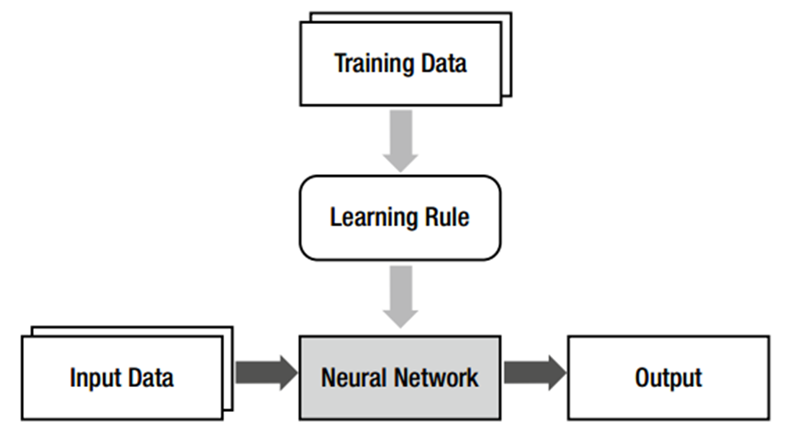

# Introduction
ចំណាំ៖ យើងមាន neural network ជំនួសឱ្យ model និង learning rule ជំនួសឱ្យ Machine Learning.  នៅក្នុងបរិបទនៃ neural network ដំណើរការនៃការកំណត់ model (neural network) ត្រូវបានគេហៅថា learning rule

